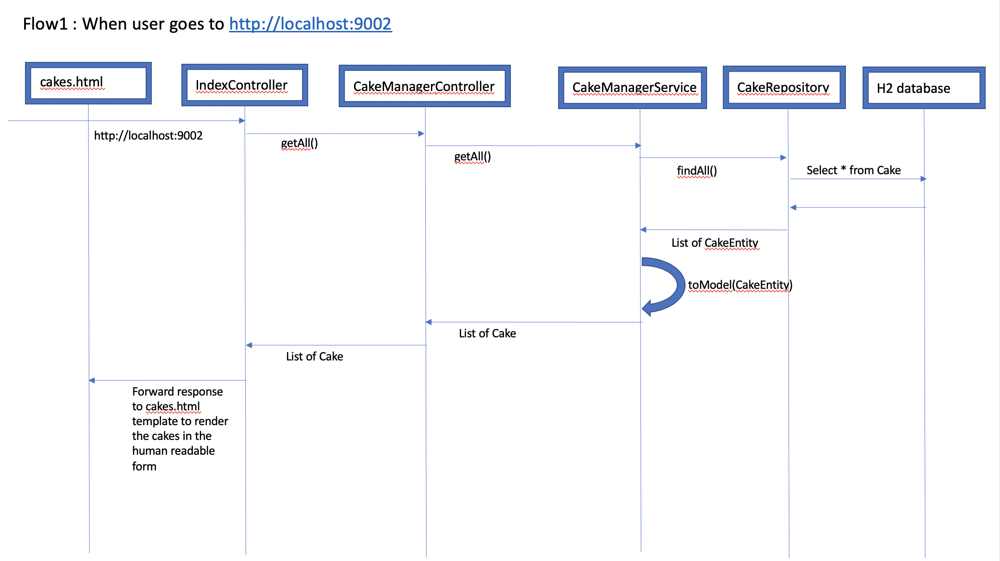
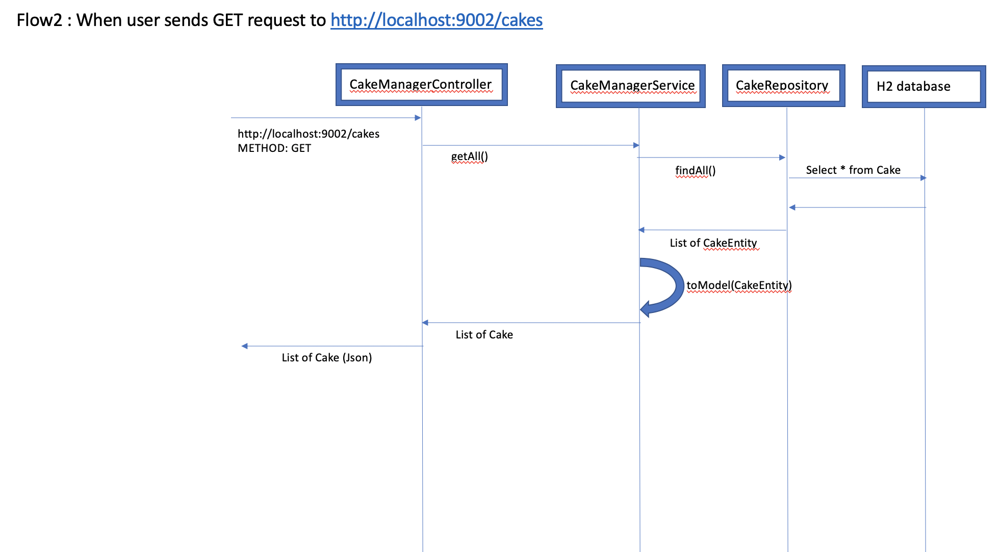
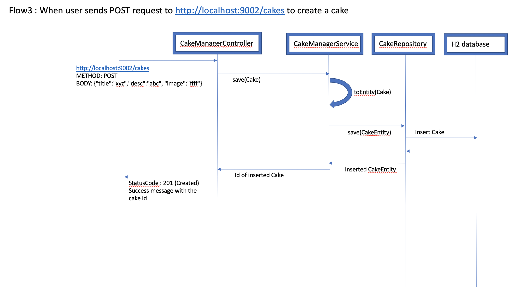
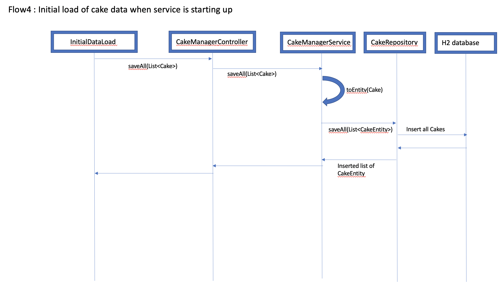

# Cake Manager Service
Introduction
============
The Cake Manager Service is one of its kind Microservice that has been implemented using the 
latest tech stack i.e. Java 1.8, Springboot 2.3.1.RELEASE, Open API, H2 in-memory database. The
service let's the cake lovers with below cool features 

1. /cakes (GET) : Users can see all the cakes on offer in the Json format & they can download it too
2. / (GET)      : This is the index page which let's users see the cakes in a human readable format with the 
mouth watering pictures of the cakes 
3. /cakes (POST) : Users can add new cakes to the store
4. /swagger-ui.html : Users can see all the Rest endpoints supported & they can try the endpoints out using the 
most user friendly user interface

Design
============

The service has been built using the below components

1. IndexController : It is responsible for responding to the "/" (default) request by returning the cakes in the 
human readable format (HTML). The response is nicely rendered by the browser in a tabular form dispalying the 
title, description & the colourful image of the cake. It leverages the CakeManagerController to retrieve all
the cakes from store in a json format & applies thymeleaf html template (src/main/resources/template/cakes.html) to give the final response back to the 
browser

2. CakeManagerController : It is the main controller that provides 2 restful endpoints which are accessed 
using /cakes . The description of the both is as given below

    - /cakes (GET)     : This endpoint lets users see/download all the available cakes in Json format
    - /cakes (POST)    : This endpoint lets users add their cakes to the store.

3. InitialDataLoad : This component is responsible for loading the initial inventory of all the cakes 
in the database. The source of initial cake data is configurable with the help of property "init.cakes.download.url" 
in src/main/resources/application.properties

4. Cake : This is the domain model of cake which comprises of attributes title, desc, image & this is the one that is exposed to the
users.

5. CakeEntity : This component is the entity which is mapped to the underlying database 
table called "Cake". 

6. CakeRepository : This is the interface that extends CrudRepository<CakeEntity, Integer> & helps with the CRUD operations on the 
"Cake" table

7. CakeManagerService : This component is the facade between the controllers & CakeRepository. It converts
domain object "Cake" into "CakeEntity" & vice-versa.

8. Application : This is the Spring Boot standard service main class to start the service

Sequence Diagrams
-----------------

1. Flow1 : When user hits the url of the service http://localhost:9002

    
    
    
2. Flow2 : When user sends the GET request to  http://localhost:9002/cakes

    
    
3. Flow3 : When user sends the POST request to  http://localhost:9002/cakes
    
    

4. Flow4 : The initial data load in the database
    
    

